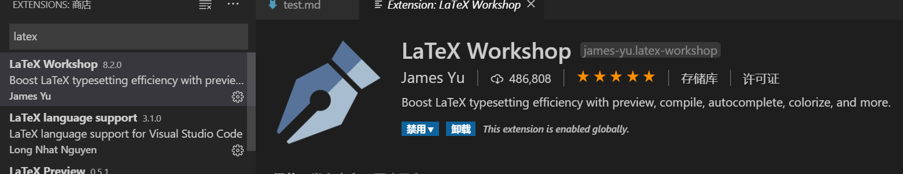
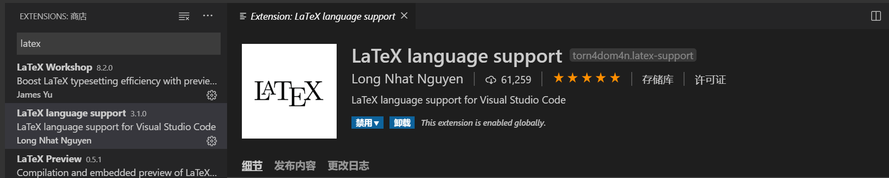
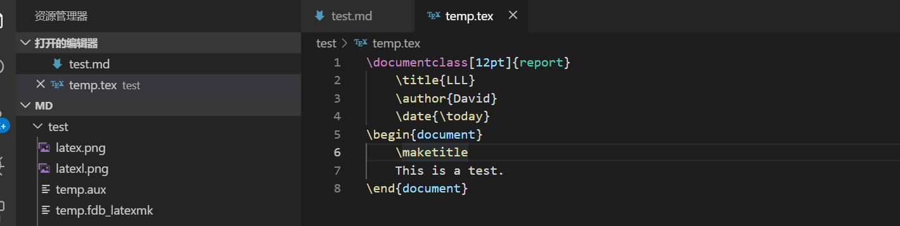
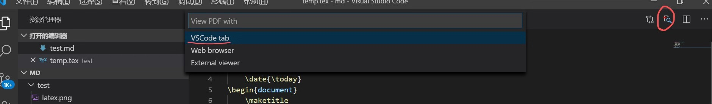
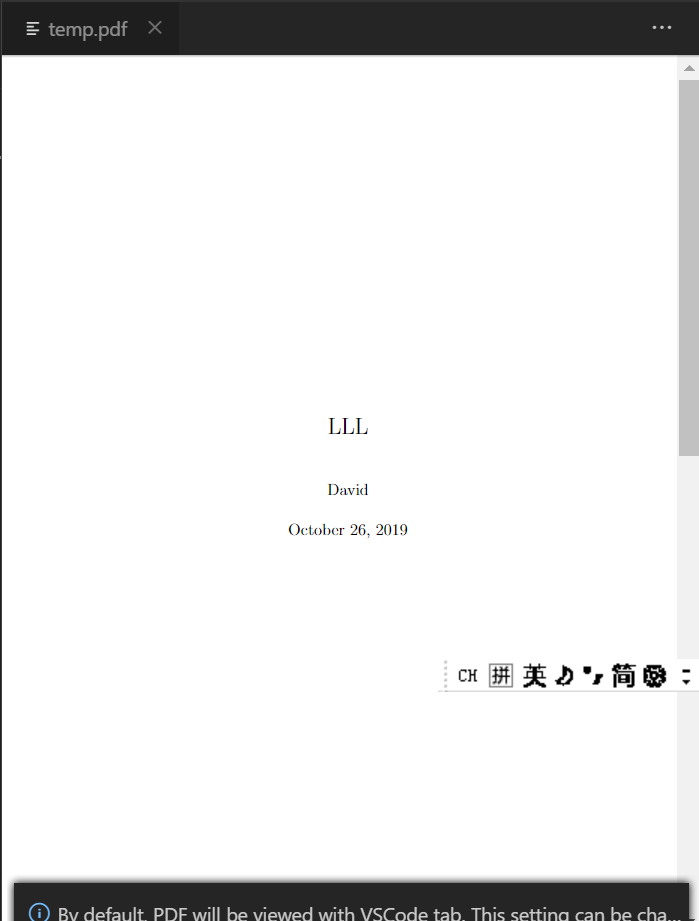

# 如何配置VScode编译Latex
## 1.安装VSCode
在网页搜索VSCode直接下载即可。
## 2.配置VSCode
### 2.1 安装LaTeX Workshop插件

点击install，安装LaTeX Workshop插件
### 2.2 安装LaTeX language support插件

点击install，安装LaTeX language support插件
## 3.测试
### 3.1写一个简单的tex文件做测试

### 3.2保存并编译tex文件
Ctrl + S保存并编译tex文件。
### 3.3查看生成的pdf

